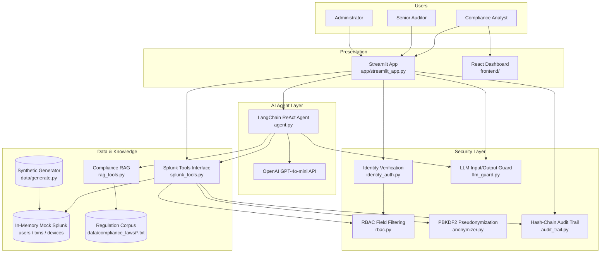
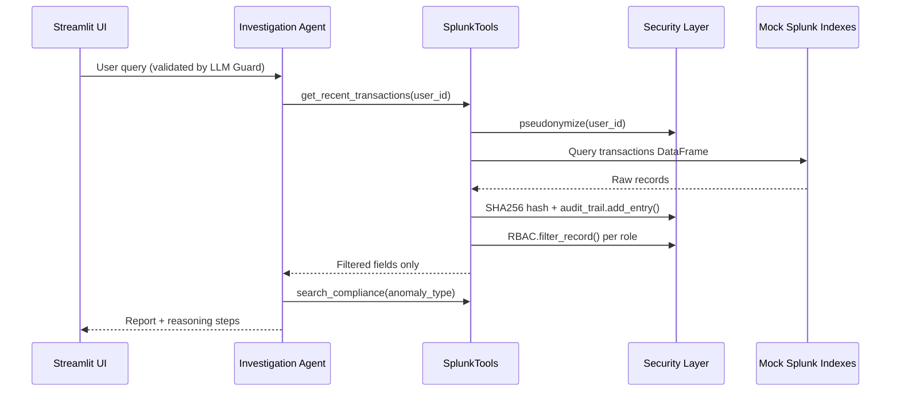
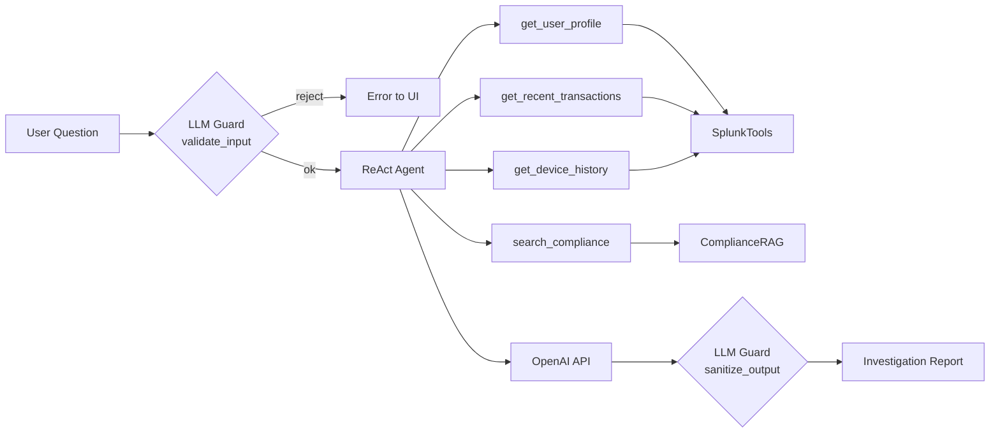

# FinGuard Compliance Copilot — Architecture

This document describes how the application interacts with **Splunk**, how **AI agents** are integrated, and the **data flow** across components.

> **Visual diagram (repo root):** [`architecture.svg`](architecture.svg)  
> GitHub also renders the Mermaid diagrams below.

---

## System Overview



---

## Splunk Integration

The project targets the **Splunk Agentic Ops** use case. Production deployments connect to Splunk Enterprise/Cloud via the Splunk SDK; this repository ships a **mock Splunk layer** so judges and developers can run everything locally without a Splunk cluster.

| Layer | File | Role |
|-------|------|------|
| **Splunk API (production path)** | `splunk-sdk` in `requirements.txt` | Official SDK for real `connect()`, `jobs.create()`, `results()` |
| **Agentic tool wrapper** | `core/splunk_tools.py` | Exposes `get_user_profile`, `get_recent_transactions`, `get_device_history`, `search_transactions` |
| **Mock data store** | In-memory Pandas DataFrames | Loaded from `data/generate.py` or CSV; simulates Splunk indexes `users`, `transactions`, `devices` |
| **Security on every query** | `splunk_tools._audit_and_filter()` | Pseudonymize → query → hash result → audit log → RBAC filter |



**Mapping to real Splunk:** Replace `load_mock_data()` with SDK calls that run SPL such as:

```spl
index=transactions user_id=$pseudonym$ earliest=-24h
| table amount, timestamp, risk_score, anomaly_type
```

---

## AI Model & Agent Integration

| Component | Technology | Purpose |
|-----------|------------|---------|
| **Orchestration** | LangChain ReAct | Multi-step reasoning: plan → tool call → observe → answer |
| **Model** | OpenAI `gpt-4o-mini` | Natural-language investigation reports |
| **Tools (4)** | Wrapped `SplunkTools` + `ComplianceRAG` | Structured data access, not raw SQL/SPL in the prompt |
| **RAG** | ChromaDB (optional) or keyword fallback | Retrieve AML / PIPL / reporting clauses |
| **Safety** | `LLMGuard` | Blocks prompt injection; sanitizes output; adds disclaimer |



**Note:** The Investigation tab requires `OPENAI_API_KEY`. Dashboard, Data Output, and Audit tabs run without it.

---

## Data Flow Summary

| Step | Data | Transformation |
|------|------|----------------|
| 1 | Raw user ID in chat | Validated, never sent to model if PII pattern detected |
| 2 | Query to Splunk tool | `Anonymizer.pseudonymize()` → irreversible token |
| 3 | Mock index lookup | Pandas filter on `users_df` / `transactions_df` / `devices_df` |
| 4 | Result | SHA256 chained into `.audit_chain.json` |
| 5 | Response to UI | Columns removed per RBAC role (analyst / auditor / admin) |
| 6 | Export (Data Output tab) | CSV manifest with visible fields only |
| 7 | React frontend | Reads `frontend/mock/transactions.json`; client-side RBAC demo |

---

## Repository Layout (runtime)

```
app/streamlit_app.py     → Entry point (auth, tabs, orchestration)
core/splunk_tools.py     → Splunk-shaped API + audit + RBAC
core/agent.py            → LangChain agent (optional)
core/rag_tools.py        → Regulation retrieval
core/audit_trail.py      → Tamper-evident log
security/*               → Auth, RBAC, anonymizer, LLM guard
ui/*                     → Dashboards, auth panel, data export
data/generate.py         → Synthetic dataset builder
data/compliance_laws/    → Example regulation text corpus
frontend/                → Optional React compliance dashboard
```

---

## Deployment Modes

| Mode | Splunk | OpenAI | ChromaDB |
|------|--------|--------|----------|
| **Demo (default)** | Mock in-memory | Optional | Keyword fallback |
| **Production** | Splunk SDK + SPL | Required | Chroma or enterprise vector DB |

See [README.md](README.md) for setup commands.
