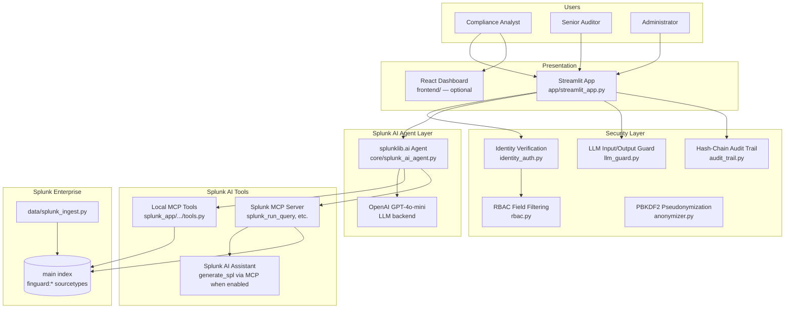
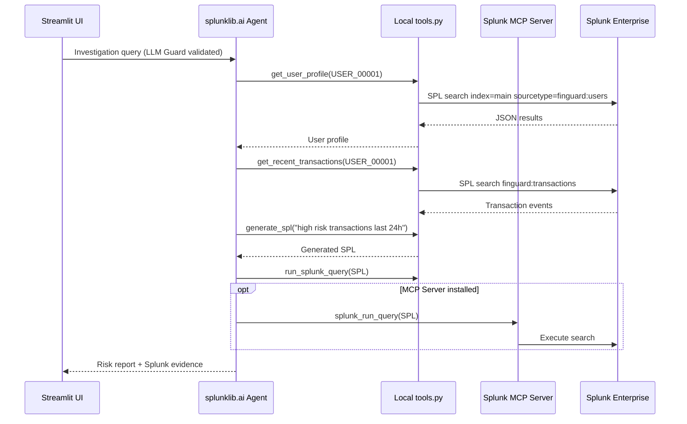
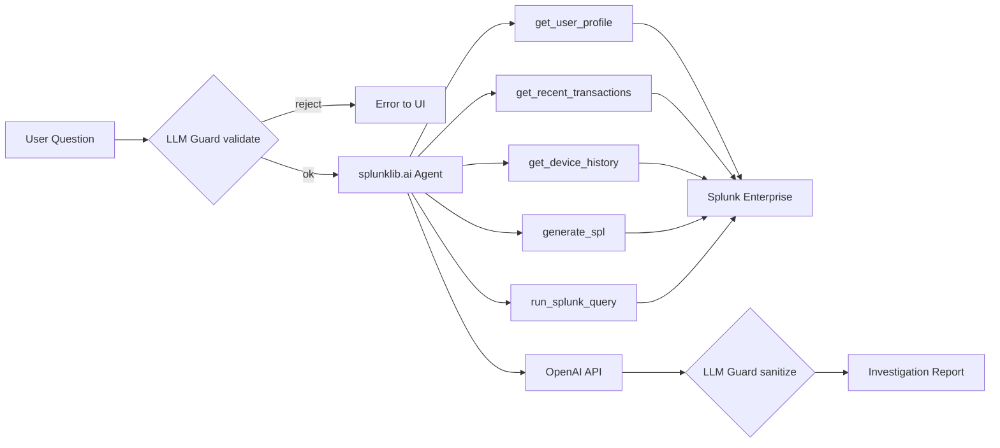

# FinGuard Compliance Copilot — Architecture

This document describes how the application interacts with **Splunk**, how **AI agents** are integrated, and the **data flow** across components — as required by the [Splunk Agentic Ops Hackathon](https://splunk.devpost.com/) submission rules.

> **Visual diagram (repo root):** [`architecture_diagram.md`](architecture_diagram.md) · [`architecture.png`](architecture.png) · [`architecture_diagram.png`](architecture_diagram.png)

---

## System Overview



---

## Splunk Integration

FinGuard uses **real Splunk Enterprise** at runtime (management API port **8089**). Synthetic compliance data is indexed into the `main` index with sourcetypes `finguard:users`, `finguard:transactions`, and `finguard:devices`.

| Layer | File | Role |
|-------|------|------|
| **Connection** | `core/splunk_connection.py` | SDK `connect()`, config from `.env` |
| **Data ingestion** | `data/splunk_ingest.py` | Index synthetic users / transactions / devices at runtime |
| **Splunk AI Agent** | `core/splunk_ai_agent.py` | `splunklib.ai.Agent` agentic investigation loop |
| **Local MCP tools** | `splunk_app/finguard_copilot/bin/tools.py` | `generate_spl`, `run_splunk_query`, profile/txn/device queries |
| **Remote MCP client** | `core/splunk_mcp_client.py` | HTTP MCP to Splunk MCP Server (`splunk_run_query`, …) |
| **Legacy mock path** | `core/splunk_tools.py` | Pandas fallback for dashboard when Splunk unavailable |



**Example SPL** (executed via local tools or MCP):

```spl
search index=main sourcetype=finguard:transactions display_user_id="USER_00001" earliest=-24h
| sort - timestamp
| table transaction_id amount timestamp anomaly_type risk_score violation_flags
```

---

## AI Model & Agent Integration

| Component | Technology | Purpose |
|-----------|------------|---------|
| **Orchestration** | `splunklib.ai.Agent` (Splunk SDK 3.0) | Agentic loop: plan → Splunk tool call → observe → answer |
| **LLM backend** | OpenAI `gpt-4o-mini` via `OpenAIModel` | Reasoning and report generation |
| **NL → SPL** | Local `generate_spl` tool + optional MCP `generate_spl` | Natural language to SPL for compliance queries |
| **Splunk queries** | Local + MCP `run_splunk_query` / `splunk_run_query` | Execute SPL on indexed finguard data |
| **Safety** | `LLMGuard` | Blocks prompt injection; sanitizes output; adds disclaimer |



**Note:** The Investigation tab requires `OPENAI_API_KEY` and a running Splunk instance with credentials in `.env`.

---

## Data Flow Summary

| Step | Data | Transformation |
|------|------|----------------|
| 1 | Sidebar: Load & Index to Splunk | `generate.py` → `splunk_ingest.py` → Splunk `main` index |
| 2 | User chat input | `LLMGuard.validate_input()` |
| 3 | Agent tool calls | SPL against real Splunk indexes (not in-memory mock) |
| 4 | Results | Optional audit entries; RBAC applies to dashboard/export tabs |
| 5 | Agent report | `LLMGuard.sanitize_output()` → UI with reasoning steps |
| 6 | React frontend (optional) | Reads `frontend/mock/transactions.json` for demo dashboard |

---

## Repository Layout (runtime)

```
app/streamlit_app.py              → Entry point (auth, tabs, Splunk AI investigation)
core/splunk_ai_agent.py           → splunklib.ai Agent wrapper
core/splunk_mcp_client.py         → Splunk MCP Server HTTP client
core/splunk_connection.py         → Splunk SDK connection
data/splunk_ingest.py             → Index synthetic data to Splunk
splunk_app/finguard_copilot/      → Local MCP tools for splunklib.ai
security/*                        → Auth, RBAC, anonymizer, LLM guard
ui/*                              → Dashboards, auth panel, data export
```

---

## Deployment

| Component | Required for Investigation | Notes |
|-----------|---------------------------|-------|
| Splunk Enterprise | Yes | Port 8089, credentials in `.env` |
| Splunk MCP Server app | Recommended | Enables remote `splunk_run_query`; local tools work without it |
| OpenAI API key | Yes | Powers `splunklib.ai` LLM backend |
| ChromaDB / LangChain | No | Legacy optional path in `core/agent.py` |

See [README.md](README.md) and [scripts/INSTALL_SPLUNK_MCP.md](scripts/INSTALL_SPLUNK_MCP.md) for setup.
