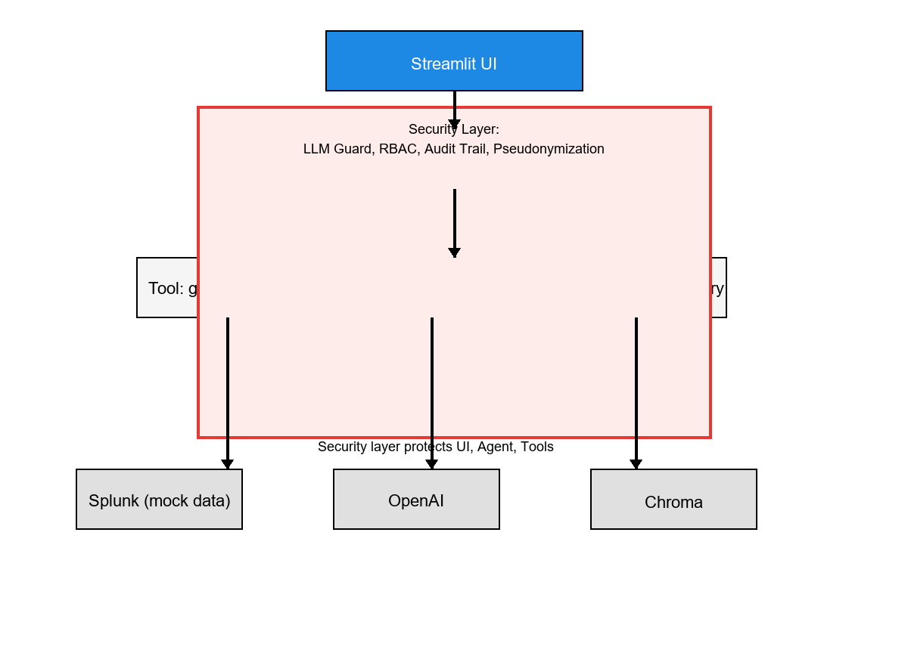

# FinGuard Compliance Copilot

AI-powered compliance investigation for suspicious transactions — **Security Track, Splunk Agentic Ops Hackathon**.

Reduce manual review from minutes to seconds with identity-verified RBAC, tamper-proof audit trails, and **Splunk AI** (`splunklib.ai.Agent`) investigation against real indexed Splunk data.

[](LICENSE)

---

## Open-Source Submission Checklist

| Requirement | Status | Location |
|-------------|--------|----------|
| Open source license | ✅ | [LICENSE](LICENSE) (MIT) |
| All source code & assets | ✅ | `app/`, `core/`, `security/`, `ui/`, `frontend/`, `data/` |
| README with setup & run | ✅ | This file |
| Dependencies & example config | ✅ | `requirements.txt`, `requirements-minimal.txt`, [.env.example](.env.example) |
| Example datasets | ✅ | [data/compliance_laws/](data/compliance_laws/), [frontend/mock/](frontend/mock/), generator in [data/generate.py](data/generate.py) |
| Architecture diagram (root) | ✅ | [architecture_diagram.md](architecture_diagram.md), [architecture_diagram.png](architecture_diagram.png), [architecture.png](architecture.png) |
| Demo video (<3 min) | ⬜ | See [SUBMISSION.md](SUBMISSION.md) for script & Devpost link |

**Architecture covers:** Splunk AI (`splunklib.ai` + MCP Server), real indexed Splunk data, and end-to-end data flow.

---

## Architecture



Also: [architecture_diagram.png](architecture_diagram.png) · [architecture.svg](architecture.svg) · [architecture_diagram.md](architecture_diagram.md)

Detailed diagrams (Mermaid sequence & component views): **[ARCHITECTURE.md](ARCHITECTURE.md)**

| Integration | Implementation |
|-------------|----------------|
| **Splunk AI** | `splunklib.ai.Agent` + Splunk MCP Server (`splunk_run_query`, etc.) |
| **Splunk Data** | `data/splunk_ingest.py` indexes compliance events to Splunk at runtime |
| **AI / Agents** | `core/splunk_ai_agent.py` — Splunk SDK AI agentic loop + OpenAI backend |
| **Data flow** | UI → Security (auth, RBAC, anonymize) → Tools → Audit hash chain → filtered response |

---

## Quick Start

### Prerequisites

- **Python 3.10+** (3.12 recommended)
- **Splunk Enterprise** (management API port **8089**) — required for Investigation tab
- **OpenAI API key** — required for Splunk AI agent (`splunklib.ai`)
- **Node.js 18+** (optional, for React dashboard only)

### 1. Clone & install (Streamlit app)

```bash
git clone https://github.com/shuibuxing00/FinGuard-Copilot.git
cd FinGuard-Copilot
python -m venv .venv
```

**Windows (PowerShell):**
```powershell
.\.venv\Scripts\Activate.ps1
pip install -r requirements-minimal.txt
```

**macOS / Linux:**
```bash
source .venv/bin/activate
pip install -r requirements-minimal.txt
```

> Use `requirements.txt` for the full stack (Investigation agent + LangChain + ChromaDB). On Windows, ChromaDB may fail to build; the app still runs with a **keyword-based RAG fallback**.

### 2. Configure environment

```bash
cp .env.example .env
# Edit .env — set SPLUNK_* credentials and OPENAI_API_KEY
```

Install Splunk MCP Server (recommended): [scripts/INSTALL_SPLUNK_MCP.md](scripts/INSTALL_SPLUNK_MCP.md).

### 3. Run Streamlit (primary app)

```bash
streamlit run app/streamlit_app.py
```

Open **http://localhost:8501**

### 4. Sign in & load data

Use matching **role + credentials** (sidebar):

| Role | Employee ID | Passcode |
|------|-------------|----------|
| Analyst (L1) | `ANA-1001` | `analyst-secure-42` |
| Auditor (L2) | `AUD-2002` | `auditor-secure-88` |
| Admin (L3) | `ADM-3003` | `admin-secure-99` |

Then click **Load & Index to Splunk** in the sidebar.

### 5. (Optional) React dashboard

```bash
cd frontend
npm install
npm run dev
```

Open **http://localhost:5173** — stats cards, RBAC table, AML rules, fund-flow graph, case export.

---

## Project Structure

```
FinGuard-Copilot/
├── LICENSE                      # MIT
├── README.md                    # This file
├── ARCHITECTURE.md              # Splunk / AI / data-flow documentation
├── SUBMISSION.md                # Hackathon checklist & demo video script
├── architecture_diagram.png     # Root architecture diagram (hackathon asset)
├── architecture.svg             # Vector architecture diagram
├── requirements.txt             # Full Python dependencies
├── requirements-minimal.txt     # Dashboard-only (no Chroma/LangChain)
├── .env.example                 # Example configuration
├── app/
│   └── streamlit_app.py         # Main entry: auth, tabs, orchestration
├── core/
│   ├── splunk_ai_agent.py       # splunklib.ai investigation agent (primary)
│   ├── splunk_mcp_client.py     # Splunk MCP Server HTTP client
│   ├── splunk_connection.py     # Splunk SDK connection
│   ├── splunk_tools.py          # Legacy mock tools + audit + RBAC
│   ├── agent.py                 # Legacy LangChain agent (optional)
│   ├── rag_tools.py             # Compliance RAG (Chroma or keyword fallback)
│   └── audit_trail.py           # SHA256 hash-chain audit log
├── security/
│   ├── identity_auth.py         # Employee ID + passcode verification
│   ├── rbac.py                  # Field-level role permissions
│   ├── anonymizer.py            # PBKDF2 pseudonymization
│   └── llm_guard.py             # Prompt injection & output sanitization
├── ui/
│   ├── auth_panel.py            # Identity verification UI
│   ├── data_output.py           # RBAC export center
│   ├── dashboard.py             # Risk metrics
│   ├── fund_flow.py             # Fund network graph
│   └── timeline.py              # Activity timeline
├── data/
│   ├── generate.py              # Synthetic users / transactions / devices
│   └── compliance_laws/         # Example regulation corpus (AML, PIPL, reporting)
├── frontend/                    # Optional React compliance dashboard
│   ├── mock/transactions.json   # 30-record sample dataset
│   └── mock/aml-rules.json      # Example AML rules
└── tests/
    └── test_security.py         # Security module unit tests
```

---

## Dependencies

### Python (`requirements.txt`)

| Package | Purpose |
|---------|---------|
| `streamlit` | Web UI |
| `pandas`, `numpy`, `plotly` | Data & charts |
| `langchain`, `langchain-openai`, `openai` | Legacy agent + Splunk AI LLM backend |
| `splunk-sdk` | Splunk connectivity + `splunklib.ai` |
| `mcp`, `httpx` | Splunk MCP Server client |
| `python-dotenv` | Environment configuration |
| `pydantic` | Data validation |

### Frontend (`frontend/package.json`)

| Package | Purpose |
|---------|---------|
| `react`, `vite` | UI framework |
| `echarts` | Fund-flow network graph |
| `tailwindcss` | Styling |

---

## Example Data & Configuration

### Synthetic transaction data (runtime)

Generated in-app via **Load Synthetic Data**, or manually:

```bash
python data/generate.py
# Writes CSVs under data/ (optional; app uses in-memory by default)
```

### Bundled datasets (in repo)

| Path | Description |
|------|-------------|
| `data/compliance_laws/anti_money_laundering.txt` | AML regulation excerpts |
| `data/compliance_laws/personal_info_protection.txt` | PIPL-style privacy rules |
| `data/compliance_laws/transaction_reporting.txt` | Reporting thresholds |
| `frontend/mock/transactions.json` | 30 transactions, 20% high-risk, anomaly types |
| `frontend/mock/aml-rules.json` | Five explainable AML rules |

### Environment variables (`.env.example`)

```env
OPENAI_API_KEY=your_key_here          # Investigation tab only
SPLUNK_HOST=localhost                 # Production Splunk
SPLUNK_PORT=8089
SPLUNK_USERNAME=admin
SPLUNK_PASSWORD=your_password
DEBUG=False
LOG_LEVEL=INFO
```

---

## Features

### Streamlit application

- **Identity verification** — no arbitrary role switching without employee ID + passcode
- **Dashboard** — risk metrics, fund-flow network, timeline
- **Data Output** — RBAC matrix, filtered tables, CSV export + manifest
- **Investigation** — **Splunk AI agent** (`splunklib.ai`) with real Splunk queries + `generate_spl`
- **Audit** — tamper-evident hash-chain status

### Security

- PBKDF2-HMAC-SHA256 pseudonymization
- Three-tier RBAC (analyst / auditor / admin)
- LLM input validation & output sanitization
- Every data query logged with SHA256 chaining

### React dashboard (optional)

- Real-time stats cards, RBAC column locking, AML rules table
- ECharts fund-flow graph, one-click case summary export

---

## Testing

```bash
pip install pytest
pytest tests/test_security.py -v
```

Covers pseudonymization, RBAC, LLM guard patterns, audit integrity, and identity auth.

---

## Splunk AI Integration

This project uses **Splunk AI capabilities at runtime**:

- `splunklib.ai.Agent` — Splunk Python SDK 3.0 agentic investigation loop
- Splunk MCP Server — remote tools (`splunk_run_query`, `splunk_get_info`, …)
- Local MCP tools — `generate_spl`, `run_splunk_query`, profile/txn/device queries in `tools.py`
- Real indexed data — `data/splunk_ingest.py` writes to Splunk `main` index

Configure `.env` (management API port **8089**, not web UI port 8000):

```env
SPLUNK_HOST=localhost
SPLUNK_PORT=8089
SPLUNK_USERNAME=admin
SPLUNK_PASSWORD=your_password
SPLUNK_INDEX=main
OPENAI_API_KEY=your_key
```

Install Splunk MCP Server: [scripts/INSTALL_SPLUNK_MCP.md](scripts/INSTALL_SPLUNK_MCP.md).

See [ARCHITECTURE.md](ARCHITECTURE.md) for SPL examples and sequence diagrams.

---

## License

This project is licensed under the **[MIT License](LICENSE)**.

Copyright (c) 2026 FinGuard Compliance Copilot Contributors

---

## Hackathon

**Track:** Security · **Theme:** AI-powered compliance with financial-grade controls

**Highlights:** Splunk AI (`splunklib.ai` + MCP) · real Splunk indexed data · verified RBAC · audit hash chain · 10-second review workflow

Full submission guide: **[SUBMISSION.md](SUBMISSION.md)**

*Synthetic data only — no real customer information.*
