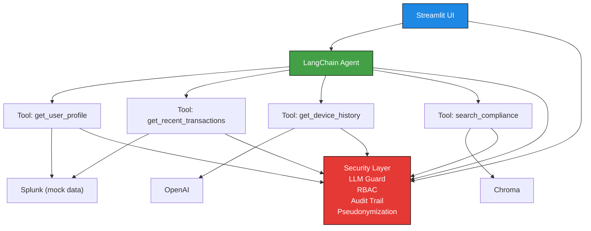

# 🛡️ FinGuard Compliance Copilot

**AI-powered compliance investigation tool that reduces suspicious transaction review time from 10 minutes to 10 seconds.**

Submitted to: **Security Track - Splunk Agentic Ops Hackathon**

---

## 🚀 Quick Start

### Prerequisites
- Python 3.9+
- OpenAI API Key
- pip package manager

### Installation

1. **Clone and navigate:**
```bash
cd FinGuard\ Copilot
```

2. **Create virtual environment:**
```bash
python -m venv venv
source venv/bin/activate  # On Windows: venv\Scripts\activate
```

3. **Install dependencies:**
```bash
pip install -r requirements.txt
```

4. **Configure environment:**
```bash
cp .env.example .env
# Edit .env and add your OPENAI_API_KEY
```

5. **Generate synthetic data:**
```bash
python data/generate.py
```

6. **Run application:**
```bash
streamlit run app/streamlit_app.py
```

Access at: **http://localhost:8501**

---

## 🔐 Security Architecture

### 1. **Tamper-Proof Audit Trail** 🔗
- Hash chain logging with SHA256 cryptographic verification
- Each entry linked to previous via hash
- Integrity verification detects any tampering
- All queries automatically logged with user role and timestamp

```
Entry 1 → Entry 2 → Entry 3 → Entry 4
   ↓         ↓         ↓         ↓
Hash1 ← Hash2 ← Hash3 ← Hash4
```

### 2. **Pseudonymization + RBAC** 👤
- **PBKDF2-HMAC-SHA256** with 100k iterations for irreversible anonymization
- **Role-Based Access Control** with three tiers:
  - **Analyst:** amount, timestamp, risk_score only
  - **Auditor:** + device, location, transaction hash
  - **Admin:** full access to all fields
- Least privilege enforced at data retrieval level

### 3. **LLM Security Guard** 🛡️
- **Input validation:** Detects prompt injection, length limits (500 chars)
- **Output sanitization:** Filters absolute judgments, enforces cautious language
- **PII protection:** Masks phone numbers, ID cards, email patterns
- **Mandatory disclaimer:** AI cannot make legal conclusions
- **Forbidden patterns:** Prevents authorization of enforcement actions

### 4. **Compliance RAG** 📚
- Vector search over real compliance regulations:
  - Anti-Money Laundering (AML) Law
  - Personal Information Protection (PIPL)
  - Transaction Reporting Rules
- Automatic citation of relevant clauses for each anomaly
- Semantic matching for compliance basis



---

## 📁 Project Structure

```
compliance-copilot/
├── README.md                              # This file
├── requirements.txt                       # Python dependencies
├── .env.example                          # Environment variables template
│
├── app/
│   └── streamlit_app.py                  # Main application entry point
│
├── core/
│   ├── __init__.py
│   ├── agent.py                          # LangChain ReAct investigation agent
│   ├── splunk_tools.py                   # Mock Splunk query interface
│   ├── rag_tools.py                      # Compliance vector search
│   └── audit_trail.py                    # Hash chain audit logging
│
├── security/
│   ├── __init__.py
│   ├── anonymizer.py                     # PBKDF2 pseudonymization
│   ├── rbac.py                          # Role-based access control
│   └── llm_guard.py                     # LLM input/output security
│
├── ui/
│   ├── __init__.py
│   ├── dashboard.py                      # Risk metrics dashboard
│   ├── fund_flow.py                      # Fund flow visualization
│   └── timeline.py                       # User behavior timeline
│
├── data/
│   ├── generate.py                       # Synthetic data generator
│   └── compliance_laws/                  # Regulation documents
│       ├── anti_money_laundering.txt
│       ├── personal_info_protection.txt
│       └── transaction_reporting.txt
│
└── tests/
    └── test_security.py                  # Security module tests
```

---

## 🎯 Core Features

### Investigation Agent
- **Multi-step reasoning** using LangChain ReAct (Reasoning + Acting)
- **Four investigation tools:**
  1. `get_user_profile` - User background and risk rating
  2. `get_recent_transactions` - 24-hour transaction history
  3. `get_device_history` - Device access patterns
  4. `search_compliance` - Relevant regulation retrieval

- **Output includes:**
  - Risk score (Low/Medium/High/Critical)
  - Identified anomalies with evidence
  - Relevant compliance regulations
  - Recommended actions for human review

### Compliance Dashboard
- **Risk metrics:** high-risk count, transaction volume, device anomalies, rule violations
- **Risk distribution chart** (Low/Medium/High/Critical)
- **Fund flow network** showing suspicious account connections
- **Activity timeline** with anomaly markers

### Pseudo-Anonymization
```python
# User: "USER_00001"
# Pseudonymized: "a7f2c9e4b1d8f3a5" (irreversible)
from security import Anonymizer
anonymizer = Anonymizer()
pseudonym = anonymizer.pseudonymize("USER_00001")
```

### Role-Based Filtering
```python
# Analyst role: sees limited data
analyst_visible = RBAC.get_visible_fields('analyst')
# ['user_id', 'amount', 'timestamp', 'risk_score', 'anomaly_type']

# Admin role: sees all data
admin_visible = RBAC.get_visible_fields('admin')
# [... 12 fields including email, phone, account_number ...]
```

---

## ⚙️ Technical Stack

| Component | Technology |
|-----------|------------|
| **UI** | Streamlit 1.28+ |
| **LLM** | OpenAI GPT-4o-mini |
| **Agent Framework** | LangChain + ReAct |
| **Vector DB** | Chroma (embedded) |
| **Data** | Pandas, NumPy |
| **API** | Splunk SDK (mock) |
| **Cryptography** | PBKDF2-HMAC-SHA256 |
| **Visualization** | Plotly |

---

## 🧪 Testing

### Run Security Tests
```bash
pytest tests/test_security.py -v
```

### Test Cases Cover:
- ✓ Pseudonymization irreversibility
- ✓ RBAC permission enforcement
- ✓ LLM guard injection prevention
- ✓ Audit trail integrity verification

---

## 📊 Usage Example

### Scenario: Investigate High-Risk User

1. **Load synthetic data** via sidebar button
2. **Select your role** (analyst/auditor/admin)
3. **Navigate to Investigation tab**
4. **Query the agent:**
   ```
   "Investigate user U_00001"
   ```

5. **Agent automatically:**
   - Retrieves user profile
   - Analyzes 24-hour transactions
   - Checks device history
   - Searches compliance regulations
   - Generates risk assessment

6. **Review results:**
   - Risk score with indicators
   - Identified anomalies
   - Compliance basis
   - Evidence traceability
   - Audit chain status

---

## 🔍 Investigation Example

**Input:**
```
Investigate user U_00001
```

**Agent Reasoning:**
```
Thought: I need to gather information about this user
Action: get_user_profile with user_id="U_00001"

Thought: Check recent transactions for anomalies
Action: get_recent_transactions with user_id="U_00001"

Thought: Review device access patterns
Action: get_device_history with user_id="U_00001"

Thought: Find relevant compliance rules
Action: search_compliance with "large_amount_threshold"
```

**Output Report:**
```
**Risk Score:** High (72/100)

**Anomalies Detected:**
- Large transaction $25,000 (5x average)
- Overnight activity 2:30 AM (unusual for this user)
- New device access from unknown location

**Compliance Basis:**
- AML Law Section 2: Large transactions >$10,000 require reporting
- Transaction Reporting Rule 5: Anomalous patterns need investigation

**Recommended Action:**
Escalate to human analyst for verification and potential customer contact.
```

---

## 🛡️ Security Measures

### Input Protection
- ✓ Prompt injection detection
- ✓ Input length limits (500 chars)
- ✓ PII leak prevention
- ✓ Reserved keyword filtering

### Output Protection
- ✓ Absolute judgment filtering
- ✓ Unauthorized action prevention
- ✓ PII masking
- ✓ Mandatory compliance disclaimer

### Data Protection
- ✓ Irreversible pseudonymization (PBKDF2)
- ✓ Role-based field filtering
- ✓ Encrypted audit trail (hash chain)
- ✓ Access logging to audit chain

### Compliance
- ✓ PIPL personal data protection
- ✓ AML transaction monitoring
- ✓ Audit trail retention
- ✓ Data minimization principle

---

## ⚠️ Important Notes

### Synthetic Data Only
- ✓ No real user information
- ✓ Randomly generated patterns
- ✓ Safe for demonstration
- ✓ All data is mock/test data

### Limitations
- Agent requires valid OpenAI API key
- Compliance RAG requires loaded regulation files
- Local Splunk simulation (not connected to real Splunk)
- Session-based data (not persistent)

### Future Enhancements
- Real Splunk API integration
- Advanced anomaly detection models
- Multi-language support
- Blockchain audit trail storage
- API-based access control

---

## 🎬 Demo Flow

1. **Launch app** → Streamlit UI loads with dark theme
2. **Load data** → Generate 10 users, 500 transactions
3. **View dashboard** → See risk distribution, fund flows, timelines
4. **Switch roles** → Watch data visibility change based on role
5. **Run investigation** → Query agent, see multi-step reasoning
6. **Check audit trail** → Verify tamper-proof chain integrity
7. **Review compliance** → See relevant regulation citations

---

## 📞 Support & Documentation

### Key Files:
- **[Core Agent](core/agent.py)** - Investigation logic
- **[Security Module](security/)** - RBAC, anonymization, LLM guard
- **[Audit Trail](core/audit_trail.py)** - Hash chain implementation
- **[UI Dashboards](ui/)** - Visualization components

### Error Handling:
All modules include try-except blocks with user-friendly error messages. Check browser console (F12) for detailed logs.

---

## 📜 License

This project is submitted to the Splunk Agentic Ops Hackathon and provided as-is for demonstration purposes.

---

## 🏆 Hackathon Submission

**Track:** Security  
**Theme:** AI-Powered Compliance Investigation  
**Differentiator:** 10-minute review reduced to 10 seconds with financial-grade security

**Key Achievements:**
- ✅ Tamper-proof audit trail with hash chain
- ✅ Pseudonymization + RBAC with least privilege
- ✅ LLM security guard preventing prompt injection
- ✅ Compliance RAG with real regulations
- ✅ Multi-step reasoning agent for analysis
- ✅ Dark theme UI with Plotly visualizations
- ✅ Comprehensive security testing

---

**Built with ❤️ for financial compliance automation**

*Generated synthetic data only - no real user information*
