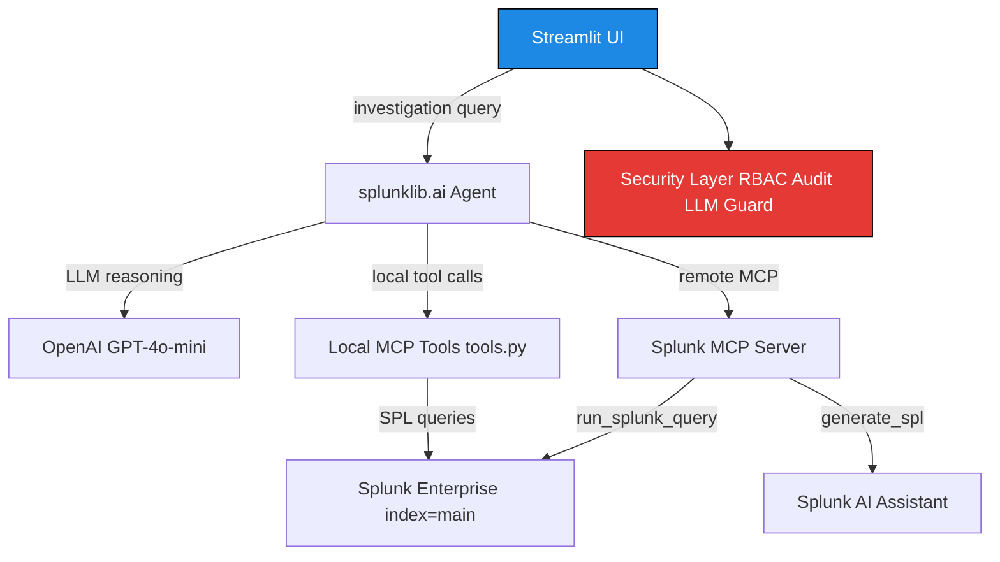

# Architecture Diagram


This repository includes a root-level architecture diagram (`architecture.png`) as required by the Splunk Agentic Ops Hackathon submission rules.

## System Architecture

FinGuard Compliance Copilot is a Streamlit investigation assistant that integrates **Splunk AI capabilities at runtime**:

| Component | Splunk AI Capability | Role |
|-----------|---------------------|------|
| `splunklib.ai.Agent` | Splunk Python SDK 3.0 AI | Agentic investigation loop |
| Splunk MCP Server | `generate_spl` (AI Assistant) | Natural language → SPL |
| Splunk MCP Server | `run_splunk_query` | Execute SPL on real indexed data |
| Local MCP tools (`tools.py`) | Splunk SDK AI local tools | User/txn/device queries |
| Splunk Enterprise | Data platform | Indexes compliance events |

## Data Flow



## Splunk Integration Points

1. **Data ingestion** (`data/splunk_ingest.py`)
   - Synthetic compliance data indexed to Splunk `main` index
   - Sourcetypes: `finguard:users`, `finguard:transactions`, `finguard:devices`

2. **Splunk AI Agent** (`core/splunk_ai_agent.py`)
   - Uses `splunklib.ai.Agent` with `OpenAIModel`
   - Loads local tools from `splunk_app/finguard_copilot/bin/tools.py`
   - Connects to Splunk MCP Server for `generate_spl` when app is installed

3. **Splunk MCP Client** (`core/splunk_mcp_client.py`)
   - HTTP MCP client for Splunk MCP Server at `https://host:8089/services/mcp`
   - Calls `generate_spl` and `run_splunk_query` AI tools

4. **Splunk connection** (`core/splunk_connection.py`)
   - Authenticates via Splunk Python SDK on port **8089** (management API)

## Installing Splunk MCP Server (for generate_spl)

The Splunk MCP Server app (Splunkbase #7931) enables the `generate_spl` AI Assistant tool:

1. Install from [Splunkbase App 7931](https://splunkbase.splunk.com/app/7931)
2. Assign `mcp_user` role capabilities to your Splunk user
3. Generate MCP bearer token in Splunk MCP Server app UI
4. Restart Splunk: `splunk restart`

Without MCP Server, the agent still uses `splunklib.ai` local tools for real Splunk queries.

## Regenerating the Diagram

```bash
python scripts/generate_architecture.py
```
