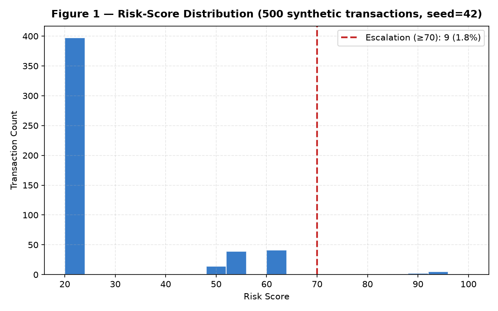
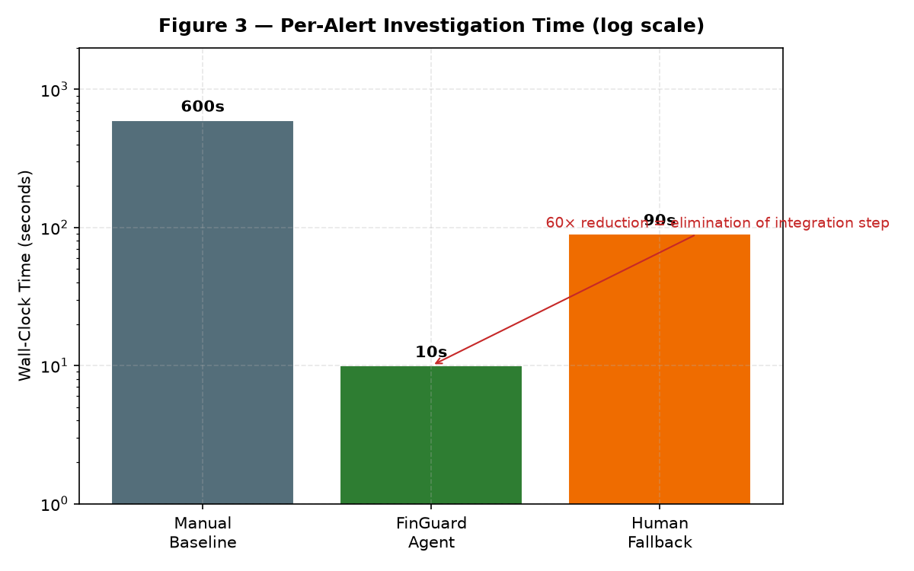

# Beyond Rule Engines

## A First-Principles Blueprint for AI-Native Financial Compliance

**FinGuard Compliance Copilot**  
Wang Manye · FinTech Programme · June 2026

> Compliance is an **information-architecture problem**, not a staffing problem.

---

## The Misunderstood Crisis

**What the industry believes:** Alert queues grow → hire more analysts → add more rules.

**What we argue:** The bottleneck is **integrating evidence** across disconnected systems.

A single alert review requires:
1. Alert / rule trigger
2. KYC profile (system 2)
3. Transaction history (system 3)
4. Device fingerprint (system 4)
5. Regulatory corpus (system 5)

**Ten minutes is not analyst slowness — it is the cognitive cost of non-integrated architecture.**

---

## Four Generations of Failure

| Generation | Architectural Move | Preserved Flaw |
|------------|-------------------|----------------|
| Rule engines (1990s) | Push decisions into Boolean rules | Evidence stays in silos |
| Statistical scoring (2000s) | Learned risk scores | "The model said so" — unauditable |
| Data centralization (2010s) | Single lakehouse | Single honeypot of PII |
| LLM copilots (2020s) | NL interface over existing stack | Inherits all prior flaws + prompt injection |

**Thirty years of mitigations. The integration step still has no home.**

---

## First Principles — Four Axioms

1. **Information architecture precedes decision quality**  
   Restructure evidence flow — don't bolt AI on a broken flow.

2. **Auditability is a substrate, not a feature**  
   Hash-chained ledger records the *trial*, not just the *verdict*.

3. **Privacy is not in tension with utility**  
   Agent reasons over pseudonyms; PII only on role-gated retrieval.

4. **Agents operate over a bounded action space**  
   Published tool registry + input/output guards — model as employee, not oracle.

---

## The Blueprint — FinGuard Reference Architecture


**Evidence substrate** → **Security layer** → **Reasoning agent** → **Verifiable decision record**

---

## Live Demo — From 10 Minutes to 10 Seconds

**Demo path (no Splunk):**
```bash
FINGUARD_DEMO_MODE=1 streamlit run app/streamlit_app.py
```

1. Sign in as Analyst (`ANA-1001`)
2. Load Synthetic Data (500 txns, seed=42)
3. Investigation: *"Investigate user USER_00001"*
4. Audit: verify hash-chain **INTACT**

**Full path:** Splunk AI (`splunklib.ai.Agent`) over indexed real data.

---

## Evidence — Signal vs. Noise



Only **~1.8%** cross the escalation line (risk ≥ 70).  
Analysts closing 30 alerts/day encounter **~29.5 noise cases per real case**.

---

## Evidence — Time Compression



**60× reduction** is not optimization — it is **elimination of the integration step**.  
Agent time bounded by tool-call latency, not human context-switching.

---

## Why Not Another Copilot?

| Typical LLM Copilot | FinGuard |
|--------------------|----------|
| Chain-of-thought lost | Tool calls hashed into ledger |
| All data flows through model | Pseudonymized evidence substrate |
| Open chat surface | RBAC-enforced tool boundary |
| Demo-grade security | PBKDF2 + LLM Guard + identity auth |

**We build verifiable infrastructure — not a chat wrapper on siloed data.**

---

## Long-Term Impact — Four Transformations

1. **Compliance as design constraint** — transactions born with evidence fields
2. **Auditor as systems auditor** — verify policy & chain, not every case
3. **Cross-border supervision tractable** — regulator publishes tool registry + corpus
4. **Information asymmetry collapses** — regulator audits the bank's audit chain

---

## The Future — Compliance as a Public Good

> Non-rivalrous: same regulatory corpus, tool registry, audit pattern serves every bank.  
> Non-excludable: regulator publishes reference implementation any institution can run.

**Analogy:** DNS, TLS, SWIFT — once per-institution costs, now shared utilities.

Criminal typology half-life drops when detected patterns propagate through the shared corpus.

---

## What We Built — Axiom → Code

| Axiom | Module |
|-------|--------|
| Unified evidence | `data/splunk_ingest.py`, Splunk index / mock |
| Audit substrate | `core/audit_trail.py` |
| Privacy | `security/anonymizer.py` (PBKDF2, 100k iter) |
| Bounded action | `core/splunk_ai_agent.py`, `security/rbac.py`, `security/llm_guard.py` |
| Demo fallback | `core/agent.py` (LangChain ReAct + RAG) |

Open source · MIT · Synthetic data only

---

## Closing

The question is no longer **whether** the integration step will be re-architected.

The question is whether it will be re-architected **deliberately** —  
on sound principles, with auditability and privacy as load-bearing properties —  
or **accidentally**, by whichever vendor ships first.

**FinGuard is the deliberate path.**

📄 `FinGuard_Beyond_Rule_Engines.pdf` · 💻 github.com/shuibuxing00/FinGuard-Copilot
